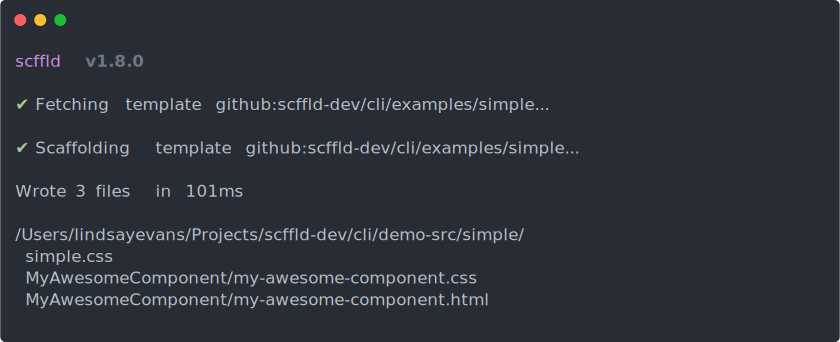

# Usage

We'll be using `npx` on this page to run the examples without installing anything.

See [installation.md](./installation.md) for local install instructions.

## Quickstart

```sh
npx @querc/scffld github:lindsayevans/scffld/examples/simple \
    --name="My Awesome Component" \
    -o ./my-project/src/
```

[](https://stackblitz.com/edit/scffld-quickstart?file=README.md)

(Windows users will need to remove `\` and put everything on one line)

Files will be created in `my-project/src`



## Slightly less-quick start

Use the [web-app template](../examples/web-app.md) without the required `name` prop:

```sh
npx @querc/scffld github:lindsayevans/scffld/examples/web-app -o ./my-web-app/src/
```

A few things to note:

- It will prompt you for the missing name, and allow you to change the defaults of any other template options
- Will prompt to overwrite any existing files
- Displays a custom post install message
- Prompts you to allow running of custom post install commands

## Basic syntax

```sh
npx @querc/scffld template [options]
```

## Local templates

1. Grab one of the [example templates](../examples/) & save it locally, or create your own (see [templates.md](./templates.md) for details)
2. Run this command, replacing `examples/simple` with your template name

```sh
npx @querc/scffld examples/simple \
    --name="My Awesome Component" \
    -o ./my-project/src/
```

Files will be created in `my-project/src`

Show supported options for the template:

```sh
npx @querc/scffld examples/simple \
    --help
```

Try it out with a few options different to the defaults:

```sh
npx @querc/scffld examples/simple \
    --name="My Other Component" \
    --includeStyle=false \
    --yeah=false \
    --nah=true \
    -o ./my-project/src/
```

or leave out all options to be prompted for them:

```sh
npx @querc/scffld examples/simple
```

## Remote templates

Templates can be loaded from a remote URL:

```sh
npx @querc/scffld https://raw.githubusercontent.com/lindsayevans/scffld/develop/examples/simple.md \
    --name="My Remote Component"
```

or from GitHub:

```sh
npx @querc/scffld github:lindsayevans/scffld/examples/simple \
    --name="My Remote Component"
```

and with a specific commit/tag/branch:

```sh
npx @querc/scffld github:lindsayevans/scffld/examples/simple@v0.11.0 \
    --name="My Remote Component"
```

## Common options

| Option                   | Details                                                                                                   |
| ------------------------ | --------------------------------------------------------------------------------------------------------- |
| `-h` `--help`            | Show available options for the template                                                                   |
| `-o` `--outputDirectory` | Base directory where files should be written<br>Defaults to the `outputDirectory` defined in the template |
| `--overwrite`            | `true`: overwrite existing files<br>`false`: exit instead of overwriting                                  |
